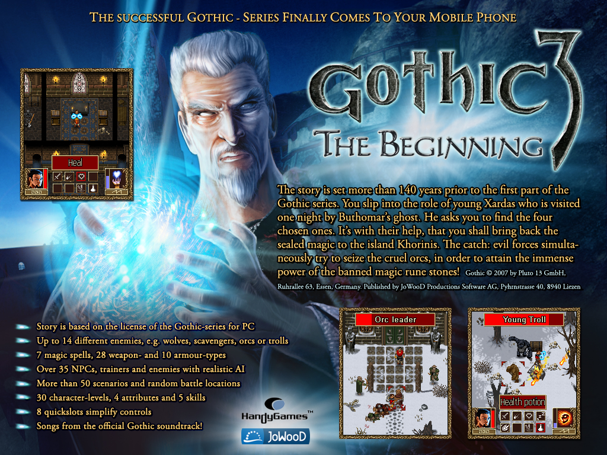

# G3TB-Modding
Gothic 3 The Beginning Modding Info Summary

This is a summary of all infos gained during exploring the Gothic 3 TB files.

>If you have any information that are not listed here, feel free to add them.



# Content of this repo

### **images**
Contains all the extracted images

### **jars**
Contains a lot of j2me jars of the game in different languages

### **music**
The game music from the game converted to mp3

### **source**
The game source code decompiled from different decompilers

### **jd-gui.zip**
The jd-gui tool to decompile and browse .jar and .class files

# File Types

## **.class**
Description of the five java/class files:

<details>
  <summary>Show class files</summary>

- A.class
  - Still unknown, feel free to contribute your knowledge here
- B.class
  - Still unknown, feel free to contribute your knowledge here
- C.class
  - Still unknown, feel free to contribute your knowledge here
- D.class
  - Still unknown, feel free to contribute your knowledge here
- HG.class
  - Still unknown, feel free to contribute your knowledge here
</details>

## **.mid**
The game music in midi file format

## **.amr**
Still unknown, feel free to contribute your knowledge here

## **.mdl**
Still unknown, feel free to contribute your knowledge here

## **a**
Still unknown, feel free to contribute your knowledge here

## **b**
Still unknown, feel free to contribute your knowledge here

## **c**
Still unknown, feel free to contribute your knowledge here

## **d**
Contains item informations for weapons, armor etc.
The structure is not fully known, feel free to contribute your knowledge here

### **Armor**

<details>
  <summary>Notes:</summary>

  ```
  That's should be all the armors.
  They are lined up and I think I've deciphered everything now.
  I'm not sure about the name with the "?" symbol.
  Both robes have a "1E" in the center.
  Do robes have a special property added there?
  Perhaps 64 is the type armor and only the last 2 digits represent the icon.
  ```
</details>

<details>
  <summary>Item list:</summary>

```
Offsets for armors are from 1369 to 1442

Light diggers trousers (Offset: 1369)
0000
16		ID
00
00		Strength needed 5
05		Prot Weapons 5
00		Prot Arrows 0
00
00 0A	Value 10
00 00 
64 0D 	Icon
-> 00 00 16 00 00 05 00 00 00 0A 00 00 64 0D

Diggers trousers (Offset: 1377)
00 00
11		ID
00		
05 		Strength needed 5
0A 		Prot Weapons 10
00 		Prot Arrows 0
00
00 1E 	Value 30
00
00
64 0D 	Icon
-> 00 00 11 00 05 0A 00 00 00 1E 00 00 64 0D

Robe (Offset: 1385)
00 00
1B		ID
00		
05		Strength needed 5
0A		Prot Weapons 10
05		Prot Arrows 5
1e		Robe indicator?
00 64	Value 100
00
00
64 0E	Icon
-> 00 00 1B 00 05 0A 05 1E 00 64 00 00 64 0E

Light leather armour (Offset 1393)
00 00
17		ID
00		
0A 		Strength needed 10
0F 		Prot Weapons 15
05 		Prot Arrows 5
00
00 50 	Value 80
00
00
64 27 	Icon
-> 00 00 17 00 0A 0F 05 00 00 50

Leather armour (Offset: 139D)
00 00
14		ID
00		
14 		Strength needed 20
14 		Prot Weapons 20
0A 		Prot Arrows 10
00
00 96 	Value 150
00
00
64 27 	Icon
-> 00 00 64 27 00 00 14 00 14 14 0A 00 00 96 00 00 64 27

Light chain mail (Offset: 13AF)
00 00 
15 		ID
00
1E		Strength needed 30
1E 		Prot Weapons 30
14		Prot Arrows 20
00
01 5E 	Value 350
00 00
64 0F 	Icon
-> 00 00 15 00 1E 1E 14 00 01 5E 00 00 64 0F

Chain mail (Offset: 13BD)
00 00 
0F		ID
00
28 		Strength needed 40
32 		Prot Weapons 50
28 		Prot Arrows 40
00
02 94 	Value 660
00
00
640F 	Icon
-> 00 00 0F 00 28 32 28 00 02 94 00 00 64 0F

Light plate mail (Offset: 13CB)
00 00 
18 		ID
00
37 		Strength needed 55
3C 		Prot Weapons 60
3C 		Prot Arrows 60
00
041A 	Value 1050
00
00
6410 	Icon
-> 00 00 18 00 37 3C 3C 00 04 1A 00 00 64 10

Plate mail (Offset: 13D9)
00 00 
1A 		ID
00
41 		Strength needed 65
46 		Prot Weapons 70
50 		Prot Arrows 80
00
06 F4 	Value 1780
00
00
6410 	Icon
-> 00 00 1A 00 41 46 50 00 06 F4 00 00 64 10

Ore Armor? (Offset: 13E7)
00 00 
19 		ID
00
4B		75
50 		80
5A		90
28		40
09 C4 	Value 2500
00
00
64 10	Icon (Plate mail)
-> 00 00 19 00 4B 50 5A 28 09 C4 00 00 64 10


Jesbar's mail shirt (Offset: 13F5)
00 00 
13 		ID
00
14 		Strength needed 20
28 		Prot Weapons 40
1E 		Prot Arrows 30
00
05DC 	Value 1500
02		2 Bonuses
02		Bonus Health
0A 		+10
05 		Bonus Dex
05 		+5
00
640F 	Icon
-> 00 00 13 00 14 28 1E 00 05 DC 02 02 0A 05 05 00 64 0F

Dusaro's Robe? (Offset: 1407)
00 00 
12 		ID
00
0F		Strength needed 15
14		Prot Weapons 20
0A		Prot Arrows 10
1E		Robe indicator?
11 94 	Value 4500
03		3 Bonuses
0A		Bonus Prot Weapons
1E		+30
0B		Bonus Prot Arrows
28		+40
03		Bonus Mana
28 		+40
00 		
64 0E 	Icon (same as Robe)
-> 00 00 12 00 0F 14 0A 1E 11 94 03 0A 1E 0B 28 03 28 00 64 0E

Corgar's Armor (Offset: 141B)
00 00 
10 		ID
00
4B 		Strength needed 75
46		Prot Weapons 70
50		Prot Arrows 80
00
0E C4	3780
03		3 Bonuses
02		Bonus Health
32		+50
04 		Bonus Strength
0A		+10
05 		Bonus Dex
05 		+5
00
64 10	Icon (same as Plate mail)
-> 00 00 10 00 4B 46 50 00 0E C4 03 02 32 04 0A 05 05 00 64 10
 
Admiral's Leather armour (Offset: 142F)
00 00 
0E 		ID
00
14		Strength needed 20
14		Prot Weapons 20
0A		Prot Arrows 10
00
0D A2	Value 3490
03 		3 Bonuses
0A		Bonus Prot Weapons
28		+40
0B 		Bonus Prot Arrows
32		+50
02		Bonus Health
32		+50
00
64 27	Icon (same as Leather armour)
-> 00 00 0E 00 14 14 0A 00 0D A2 03 0A 28 0B 32 02 32 00 64 27
```
</details>

**Weapons**

<details>
  <summary>Notes:</summary>

  ```
  I was able to find something with weapons:
  For example, Light Crossbow
  28 40 Range
  23 35 Speed
  00 5A 90 Value
  It's the same for all weapons, only the range value sometimes deviates.
  The hit chance seems to only depend on the skill and is 56 with a starting value of 5 for every weapon.
  I still don't know how damage and critical hits are determined.

  All weapons have the form:
  00 00 01 no idea, don't know if it belongs to this or previous item
  BE

  There were 2 weapons I couldn't categorize (an expensive crossbow and a 1H weapon with value 6)
  I searched for the Admiral's Platinum Ring with the bonus format. I just entered "03 04 0A 05 0A" because:
  03 3 bonuses
  04 0A +10 strength
  05 0A +10 dex
  and I actually found
  08 CA 03 04 0A 05 0A 06 14
  at position 1754

  I think 00 00 at the beginning means armor and 00 01 weapon.

  I have no idea what the last digit in the weapons does, it's always 00, 01, 02, or 03.

  War-bow, Bow 46-57 50 range 10 crit
  02 2 Item Type (2 = Bow)
  2D 45 Damage?
  01 1 Required Stat (1 = Dexterity)
  46 70 Required Value in Stat
  32 50 Range?
  37 55 Speed
  04 7E 1150 Value
  03 3 +Crit chance?
  00 00
  5F 0B Icon
  00 00 01 no idea, don't know if it belongs to this or next item
  BD 189
  And except for the mysterious bytes in between, they also lie next to each other.
  ```
</details>

<details>
  <summary>Item list:</summary>

  ```
  Offsets for weapons are from 10F4 to 1364:

  Old Battle Axe (Offset: 10F4)
  00 01 
  EA 
  01 				2H
  3F 
  00 
  35 
  12 
  2D 
  03 D4 	980		Value
  03
  00 00 
  63 09 			Icon
  00
  -> 00 01 EA 01 3F 00 35 12 2D 03 D4 03 00 00 63 09

  Axe, 1H			33-41		10 range	9 crit (Offset: 1104)
  00 01
  DC		220
  00				1H
  1D		29
  00
  0E		14		Strength needed
  0B		11		Range
  3C		60		Speed
  01 40	320		Value
  02 
  00 00 
  63 02 			Icon
  02
  -> 00 00 01 DC 00 1D 00 0E 0B 3C 01 40 02 00 00 63 02

  Bastard Sword, 1H (Offset: 1115)
  00 01
  DD		221
  00 				1H
  32 		50
  00 
  32 		50		Strength needed
  0F		15		Range
  4B 		75		Speed
  07 44 	1860	Value
  06 
  00 00 
  5B 00 			Icon
  01
  -> 02 00 01 DD 00 32 00 32 0F 4B 07 44 06 00 00 5B 00 01

  Broad Sword, 1H		42-52	13 range	12 crit (Offset: 1127)
  00 01
  DF		223
  00				1H
  28		40		
  00
  2D		45		Strength needed
  0E		14		Range?
  4B 		75		Speed
  04 D8 	1240	Value
  05 
  00 00 
  5B 00 			Icon
  01
  -> 00 01 DF 00 28 00 2D 0E 4B 04 D8 05 00 00 5B 00 01

  Dagger, 1H		13-16		9 crit	10 range (Offset: 1138)
  00 01 
  E1 		225
  00 				1H
  04 		4
  00 
  05 		5		Strength needed
  0A 		10		Range?
  5F 		95		Speed
  00 05 	5		Value
  02 
  00 00 
  5B 05 			Icon
  01
  -> 00 01 E1 00 04 00 05 0A 5F 00 05 02 00 00 5B 05 01

  Halberd, 2H		69-86		11 crit (Offset: 1149)
  00 01
  E4 		
  01 				2H
  4A 		74
  00 
  40 		64		Strength needed
  14 		20		Range
  32 		50		Speed
  04 F6 	1270	Value
  04 		4		+Crit
  00 00 
  5D 03 			Icon
  00
  -> 00 01 E4 01 4A 00 40 14 32 04 F6 04 00 00 5D 03 00

  Disposer Staff, 2H		38-47		15 range	10 crit (Offset: 115A)
  00 01 
  E2 
  01 				2H
  23 		35
  00 
  1E 		30		Strength needed
  10 		16		Range?
  41 		65		Speed
  01 86 	390		Value
  03 
  00 00 
  5C 04 			Icon
  01 
  -> 00 01 E2 01 23 00 1E 10 41 01 86 03 00 00 5C 04 01

  Quarterstaff, 2H	26-32	15 range	9 crit (Offset: 116B)
  00 01
  EB 		235
  01 				2H
  14 		20
  00 
  0F 		15		Strength needed
  10 		16		Range?
  46 		70		Speed
  00 3E	62		Value
  02 		2		+Crit?
  00 00 
  5C 04 			Icon
  01
  -> 00 01 EB 01 14 00 0F 10 46 00 3E 02 00 00 5C 04 01

  Katana, 1H		54-67	12 range	14 crit (Offset: 117C)
  00 01 
  E5 
  00  			1H
  37 
  00 
  3C 		60		Strength needed
  0D 		13		Range?
  55 				Speed
  08 98 	2200	Value
  07 
  00 00 
  5B 06 			Icon
  01
  -> 00 01 E5 00 37 00 3C 0D 55 08 98 07 00 00 5B 06 01

  ?Unknown? (Offset: 118D)
  00 01 
  E0 
  00  			1H
  05 
  00 
  05 
  0A 
  3C 		60		Speed
  00 06 	6		Value
  01 
  00 00 
  5E 07 			Icon
  00
  -> 00 01 E0 00 05 00 05 0A 3C 00 06 01 00 00 5E 07 00

  War Hammer, 2H	30-37		9 crit (Offset: 119E)
  00 01 
  F2 		242
  00 
  19 		25		
  00 
  0C 		12		Strength needed
  0C 		12		Range?
  41		50		Speed
  00F0 	240		Value
  02 
  00 00 
  61 03 			Icon
  02
  -> 00 01 F2 00 19 00 0C 0C 41 00 F0 02 00 00 61 03 02

  Short Sword, 1H		19-24		8 crit	10 range (Offset: 11AF)
  00 01 
  EE 
  00 
  0C 
  00 
  0F 		15		Strength needed
  0B 		
  5A 		90		Speed
  00 2C 	44		Value
  01 
  00 00 
  5B 00 			Icon
  01
  -> 00 01 EE 00 0C 00 0F 0B 5A 00 2C 01 00 00 5B 00 01

  Long Sword (Offset: 11C0)
  00 01 
  E7 
  00  			1H
  2D 
  00 
  2D 
  0E 
  50 		80		Speed
  05 8C 	1420	Value
  03 
  00 00 
  5B 00 			Icon
  01
  -> 00 01 E7 00 2D 00 2D 0E 50 05 8C 03 00 00 5B 00 01

  Knife		12-15		10 range	8 crit (Offset: 11D1)
  00 01 
  E6 
  00 				1H
  03 
  00 
  05 
  0A 
  64 		100		Speed
  00 03 	3		Value
  01 
  00 00 
  5B 05 
  01
  -> 00 01 E6 00 03 00 05 0A 64 00 03 01 00 00 5B 05 01

  Spiked Mace (Offset: 11E2)
  00 01 
  E9 
  00 				1H
  14 
  00 
  1E 
  0E 
  3C 
  00 7D 	125		Value
  04 
  00 00 
  61 08 
  02
  -> 00 01 E9 00 14 00 1E 0E 3C 00 7D 04 00 00 61 08 02

  Rusty Sword (Offset: 11D3)
  00 01 
  EC 
  00 				1H
  08 
  00 
  0A 
  0C 
  4B 		75		Speed
  00 0A 	10		Value
  02 
  00 00 
  5B 00 
  01
  -> 00 01 EC 00 08 00 0A 0C 4B 00 0A 02 00 00 5B 00 01

  Rusty Two Handed Sword (Offset: 1204)
  00 01 
  ED 
  01 				2H
  32 
  00 
  2D 
  13 
  3C 
  02 44 	580		Value
  02 
  00 00 
  62 01 			Icon
  03
  -> 00 01 ED 01 32 00 2D 13 3C 02 44 02 00 00 62 01 03

  Battle Axe (Offset: 10F4)
  00 01 
  DE 
  01 				2H
  59 
  00 
  48 
  12 
  2D 		45		Speed
  06 FE 	1790	Value
  04 
  00 00 
  63 09 
  00
  -> 00 01 DE 01 59 00 48 12 2D 06 FE 04 00 00 63 09 00

  Mace (Offset: 1226)
  00 01 
  E8 
  00 
  0F 
  00 
  14 
  0C 
  3C 
  00 42 		66		Value
  03 
  00 00 
  61 08 
  02
  -> 00 01 E8 00 0F 00 14 0C 3C 00 42 03 00 00 61 08 02

  Two Handed Sword (Offset: 1237)
  00 01 
  F1 			
  01 
  55 
  00 
  4B 			75		Strength needed
  13 
  41 			65		Speed
  07 9E 		1950	Value
  05 
  00 00 
  62 01 				Icon
  03
  -> 00 01 F1 01 55 00 4B 13 41 07 9E 05 00 00 62 01 03

  Bow, B		30-37		40 range	8 crit (Offset: 1248)
  00 01
  B7 
  02 
  19 
  01 
  19 
  28 
  2D 			45		Speed
  00 6E 		110		Value
  01 
  00 00 
  5F 0A 				Icon
  00
  -> 00 01 B7 02 19 01 19 28 2D 00 6E 01 00 00 5F 0A 00

  War-bow, Bow		46-57		50 range	10 crit (Offset: 1259)
  00 01 			
  BE 
  02 			2		Item Type (2 = Bow)
  2D 			45		Damage?
  01 			1		Required Stat (1 = Dexterity)
  46 			70		Required Value in Stat
  32 			50		Range?
  37 			55		Speed
  04 7E 		1150	Value
  03 			3		+Crit chance?
  00 00 
  5F 0B 				Icon
  00
  -> 00 01 BE 02 2D 01 46 32 37 04 7E 03 00 00 5F 0B 00

  Short-bow			19-24		30 range	8 crit (Offset: 126A)
  00 01 			
  BD 			189		
  02 			2		Item Type (2 = Bow)
  0C 			12		Damage?
  01 			1		Required Stat (1 = Dexterity)
  0A 			10		Required Value in Stat
  1E 			30		Range?
  2D 			45		Speed
  00 3C 		60		Value
  01 			1		+Crit chance?
  00 00 
  5F 0A 				Icon
  00
  -> 00 01 BD 02 0C 01 0A 1E 2D 00 3C 01 00 00 5F 0A 00

  Long-bow, B		38-47		50 range	9 crit (Offset: 127B)
  00 01 			
  BC 
  02 
  23
  01 
  28 			40		Dexterity needed
  32 			50
  32 			50		Speed
  01 A4 		420		Value
  02 
  00 00 
  5F 0B 				Icon
  00
  -> 00 01 BC 02 23 01 28 32 32 01 A4 02 00 00 5F 0B 00


  Light Crossbow, XB	26-32	35 speed	40 range		9 crit (Offset: 128C)
  00 01
  BB			187
  03
  14			20
  01 
  14			20		Dexterity needed
  28 			40		Range
  23 			35		Speed
  00 5A		90		Value
  02 
  00 00 
  60 0C 				Icon
  00
  -> 00 01 BB 03 14 01 14 28 23 00 5A 02 00 00 60 0C 00

  Crossbow (Offset: 129D)
  00 01
  B8			184
  03
  1E			30		
  01
  23			35		Dexterity needed
  2D			45		Range
  2D			45		Speed
  01 4A		330		Value
  03 
  00 00 
  60 0C 				Icon
  00
  -> 00 01 B8 03 1E 01 23 2D 2D 01 4A 03 00 00 60 0C 00

  Heavy Crossbow, XB	42-52	35 speed	50 range		12 crit (Offset: 10F4)
  00 01
  B9			185
  03
  28			40
  01
  32			50		Dexterity needed
  32			50		Range
  23 			35		Speed
  02 A8		680		Value
  05 
  00 00 
  60 0C 				Icon
  00
  -> 00 01 B9 03 28 01 32 32 23 02 A8 05 00 00 60 0C 00

  ?Unknown? (Offset: 12BF)
  00 01
  BF
  03 					Crossbow
  32 
  01 
  41 
  37 
  2D 
  05 5A 		1370
  06 
  00 00 
  60 0C 				Icon
  00
  -> 00 01 BF 03 32 01 41 37 2D 05 5A 06 00 00 60 0C 00


  Kilbas' Bow? (Offset: 12D0)
  00 01 
  BA 
  02 					Bow
  1E 
  01 
  28 					Dexterity needed
  32 			50
  3C 			60
  03 20 		800		Value
  03 
  02 					2 Bonuses
  02 					Health Bonus
  14 					+20
  05 					Dex Bonus
  05 					+5
  00 
  5F 0B 				Icon
  00
  -> 00 01 BA 02 1E 01 28 32 3C 03 20 03 02 02 14 05 05 00 5F 0B 00


  ?Todesstab? (Offset: 12E5)
  00 01 
  EF 
  01 					2H
  28 
  00 
  2D 
  10 
  41 
  05 8C 		1420	Value
  03 
  02 					2 Bonuses
  08 					Ice Damage Bonus
  0A 					+10
  09 					Crit Bonus
  03 					+3
  00 
  5C 04 				Icon
  01
  -> 00 01 EF 01 28 00 2D 10 41 05 8C 03 02 08 0A 09 03 00 5C 04 01

  Admiral's Crossbow? (Offset: 12FA)
  00 01 
  B6 
  03 					Crossbow
  32 
  01 
  46 
  3C 
  37 
  5F FA 	24570		Value
  06 
  02 					2 Bonuses
  05 					Dex Bonus
  0A 					+10
  07 					Fire Damage Bonus
  0F 					+15
  00 
  60 0C 				Icon
  00
  -> 00 01 B6 03 32 01 46 3C 37 5F FA 06 02 05 0A 07 0F 00 60 0C 00

  Admiral's Bow? (Offset: 130F)
  00 01 
  B5 
  02 					Bow
  28 
  01
  41 
  32 
  37 
  42 FE 		17150	Value
  04 
  03 					3 Bonuses
  06 					attack speed OR bow
  0A 					+10
  08 					Ice Damage Bonus
  0A 					+10
  0E 					attack speed OR bow
  0A 					+10
  00 
  5F 0B 				Icon
  00
  -> 00 01 B5 02 28 01 41 32 37 42 FE 04 03 06 0A 08 0A 0E 0A 00 5F 0B 00

  Admiral's Sword? (Offset: 1326)
  00 01 
  DA 
  00 					1H
  32 
  00 
  37 
  0F 
  4B 
  5D 34 		23860	Value
  06 
  02 					2 Bonuses
  0C 					1H Bonus
  0F 					+15
  07 					Fire Damage Bonus
  0A 					+10
  00 
  5B 00 				Icon
  01
  -> 00 01 DA 00 32 00 37 0F 4B 5D 34 06 02 0C 0F 07 0A 00 5B 00 01

  Admiral's Two Hander? (Offset: 133B)
  00 01 
  DB 
  01 					2H
  55 
  00 
  50 
  13 
  41 
  57 E4 		22500	Value
  05 
  03 					3 Bonuses
  04 					Strength Bonus
  0A 					+10
  09 					Crit Bonus
  05 					+5
  07 					Fire Damage Bonus
  05 					+5
  00 
  62 01 				Icon
  03
  -> 00 01 DB 01 55 00 50 13 41 57 E4 05 03 04 0A 09 05 07 05 00 62 01 03

  Fire Axe? (Offset: 104F)
  00 01 
  E3 
  00 					1H
  1D 
  00 
  18 
  0B 
  3C 
  03 98 		920		Value
  02 
  01 					1 Bonus
  07 					Fire Damage Bonus
  0A 					+10
  00 
  63 02 				Icon
  02
  -> 00 01 E3 00 1D 00 18 0B 3C 03 98 02 01 07 0A 00 63 02 02
  ```
</details>

### **Jewellery**

<details>
  <summary>Notes:</summary>

  ```
  No notes at the moment
  ```
</details>

<details>
  <summary>Item list:</summary>

  ```
  Offsets for jewellery are from 16D6 to ???

  Copper ring (Offset: 16D6)
  00 00 03 00 00 
  00 05 		5			Value	
  00 
  00 
  69 12 					Icon Ring
  -> 00 00 03 00 00 00 05 00 00 69 12

  Silver ring (Offset: 16DE)
  00 00 0B 00 01
  00 14 		20			Value		
  00 
  00 
  69 12 					Icon Ring
  -> 00 00 0B 00 01 00 14 00 00 69 12

  Gold ring (Offset: 16E9)
  00 00 05 00 02
  00 32			50			Value
  00 
  00 
  69 12 					Icon Ring
  -> 00 00 05 00 02 00 32 00 00 69 12

  Copper amulet (Offset: 16F4)
  00 00 02 01 00
  00 08 		8			Value
  00 
  00 
  6A 26   					Icon Amulet
  -> 00 00 02 01 00 00 08 00 00 6A 26

  Silver amulet (Offset: 1700)
  00 00 0A 01 01 
  00 1E 		30			Value
  00 
  00 
  6A 26   				Icon Amulet
  -> 00 0A 01 01 00 1E 00 00 6A 26

  Gold amulet (Offset: 170A)
  00 00 04 01 02
  00 4B		75			Value
  00 
  00 
  6A 26  					Icon Amulet
  -> 00 00 04 01 02 00 4B 00 00 6A 26

  Kilbas' Ring (Offset: 1715)
  00 00 06 00 00
  01 F4 		500			Value
  02 						2 Bonuses
  0E 						Bow
  0A 						+10
  0B						Prot Weapons
  05 						+5
  00 
  69 12 					Icon
  -> 00 00 06 00 00 01 F4 02 0E 0A 0B 05 00 69 12 

  Lakos' Kette (Offset: 1724)
  00 00 07 01 00
  00 C8 		200			Value
  01 						1 Bonus
  09 						Crit Bonus
  05 						+5
  00 
  6A 26 					Icon
  -> 00 00 07 01 00 00 C8 01 09 05 00 6A 26

  Tunas Anhänger (Offset: 1731)
  00 00 0C 01 00 
  00 C8  		200			Value
  01 						1 Bonus
  02 						Health Bonus
  0F 						+15
  00 
  6A 26 					Icon
  -> 00 00 0C 01 00 00 C8 01 02 0F 00 6A 26


  Todesring (Offset: 173E)
  00 00 08 00 02
  0A 8C 		2700		Value
  03 						3 Bonuses
  09 						Crit
  05 						+5
  06 						Speed
  0F 						+15
  04 						Strength
  0A 						+10
  00 
  69 12 					Icon
  -> 00 00 08 00 02 0A 8C 03 09 05 06 0F 04 0A 00 69 12

  Admirals Platinring (Offset: 16F4)
  00 00 01 00 02 
  08 CA 		2250		Value
  03 						3 Bonuses
  04 						Str
  0A 						+10
  05 						Dex
  0A 						+10
  06 						Speed
  14 						+20
  00 
  69 12 					Icon
  -> 00 00 01 00 02 08 CA 03 04 0A 05 0A 06 14 00 69 12

  Admirals Glücksbringer (Offset: 1760)
  00 00 00 01 00
  08 61 		2145		Value
  03 						3 Bonuses
  09 						Crit
  0A 						+10
  05 						Dex
  14 						+20
  11 						Open Locks
  14 						+20
  00 
  6A 26 					Icon
  -> 00 00 00 01 00 08 61 03 09 0A 05 14 11 14 00 6A 26

  Ring des Lebens (Offset: 1771)
  00 00 09 00 02
  04 B0 		1200		Value
  02 						2 Bonuses
  02 						Health
  28 						+40
  03 						Mana
  1E 						+30
  00 
  69 12 					Icon
  -> 00 00 09 00 02 04 B0 02 02 28 03 1E 00 69 12

  00 80 00 07 00 01 ???

  ```
</details>

<details>
  <summary>Item list:</summary>

  ```
  List the items here
  ```
</details>

### **Bonuses**

<details>
  <summary>Notes:</summary>

  ```
  Add notes here
  ```
</details>

<details>
  <summary>Item list:</summary>

  ```
  00		Health
  01		Mana
  02		Max. Health
  03		Max. Mana
  04		Strength
  05		Dex
  06		Attack Speed
  07		Fire Damage
  08		Ice Damage
  09		Crit
  0A		Prot Weapons
  0B		Prot Arrows
  OC		1H
  OD		2H
  OE		Bow
  0F		Crossbow
  10		Weapon skill (current type)
  11		Open Locks
  ```
</details>

### **Copy me to add new item types if you found some**

<details>
  <summary>Notes:</summary>

  ```
  Add notes here
  ```
</details>

## **f**
Still unknown, feel free to contribute your knowledge here

## **i**
Contains the charset (text characters) used in the game and all the images (png format)

A tool for extracting and packing them back is available here: [G3TB-PngPacker](https://github.com/RednibCoding/G3TB-PngPacker)

## **.ldf**
Still unknown, feel free to contribute your knowledge here

## **.lng**
Contains all the dialogs and text from the game. The structure is not fully known, feel free to contribute your knowledge here
